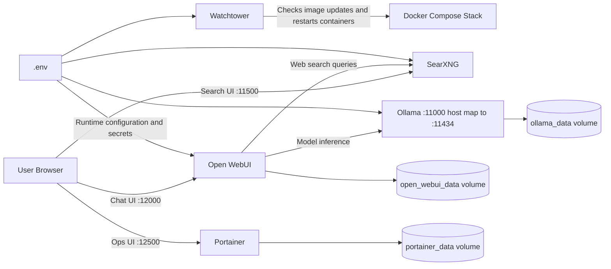

# Ollama Docker Setup

Small, practical setup for running Ollama with Docker Compose.

## Architecture and concepts



Core concepts:

- Ollama serves local LLM inference and stores pulled models in a persistent volume.
- Open WebUI provides the chat frontend and can call SearXNG for RAG web search.
- SearXNG provides self-hosted search to avoid external search API dependencies.
- Portainer gives a web UI for operational management of containers and volumes.
- Watchtower automates container image updates on a configured schedule.
- Environment values in .env keep runtime settings and sensitive keys out of versioned files.

## Repository layout

- containers/: Ollama container configuration and usage guide

## Quick start

1. Go to the models folder.
2. Start the service.
3. Check running status.

```bash
cd containers
docker compose up -d
docker compose ps
```

## API endpoint

When running locally, Ollama is exposed at:

- http://localhost:11000

## Useful commands

```bash
cd containers
docker compose logs -f ollama
docker compose exec ollama ollama list
docker compose exec ollama ollama pull llama3.2:3b
```

## Documentation

See containers/README.md for:

- Connection methods
- Ollama command reference
- GPU-friendly model selection tables
- Troubleshooting steps

## Requirements

- Docker Engine with Compose support
- NVIDIA drivers and NVIDIA Container Toolkit (for GPU)

## License

MIT. See LICENSE.
